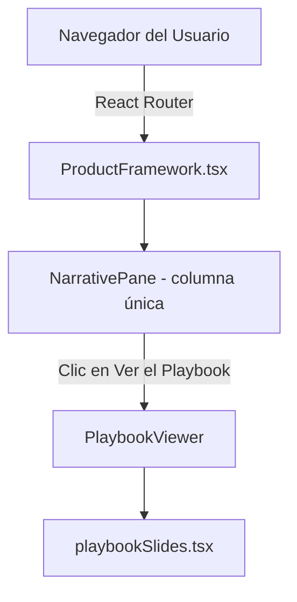

# Spec — Spec VJC Showcase

**Basada en:** PRD-lite v0.1 · `requirements.md` v0.1 (No existe, embebido) · **Etapa:** prototipo · **Exposición:** X1
**Fecha:** 2026-08-06 · **Versión:** 0.3

> Secciones 1-5, 11 y 12: núcleo, siempre. Secciones 6-10 y 13: se activan por exposición (`docs/modelo.md` §3.2). Las no activadas se omiten (marcadas con N/A).
>
> **Nota de versión:** la v0.2 describía la arquitectura split-screen/sticky con `IntersectionObserver` y `VisualizerPane`. El commit `3adcf5c` (repo `victorcorral`) la sustituyó por un layout vertical de una sola columna más un modal "Playbook" independiente — el bug de scroll de escritorio que arrastraba esa arquitectura (`informe-verificacion-2026-08-06.md`, H-07) se resolvió eliminando el patrón, no depurándolo. Esta v0.3 documenta el sistema tal y como existe en el código a fecha 2026-08-06 (`informe-auditoria-commit-3adcf5c.md`). El Quality Gate de la sección final corresponde a la v0.2 y **no cubre** los cambios de esta versión — pendiente de re-ejecutar `/quality-gate`.

## 1. Contexto y arquitectura
**Stack elegido:** React, Vite, Tailwind CSS (integrado en el repositorio `victorcorral`). (Ref: PRD AS-01 actualizado)
**Componentes y flujo de datos:**

**Límites de confianza:** El sistema completo se ejecuta en el cliente (navegador). No hay backend ni procesamiento de datos de usuario, manteniendo un límite estricto de exposición nivel X1.

## 2. Trazabilidad
| Req ID | Requisito | Capacidad | Origen (E-n/RC-XX/C-n/AS-nn/ADR) | Criterio de verificación | Tipo |
|--------|-----------|:---:|----------------------------------|--------------------------|:---:|
| R-01 | Layout vertical de una sola columna; cada sección muestra narrativa y tarjeta ilustrativa lado a lado en desktop, apiladas en mobile (`flex-col lg:flex-row`) | C1 | C1 | Sin panel fijo/sticky; el documento entero se desplaza como una página normal | inspección |
| R-02 | Tarjeta de Simulador de Evidencia (Sección 2) | C2 | C2 | Renderizada estáticamente dentro del flujo del documento | inspección |
| R-03 | Tarjeta de Simulador de Quality Gate (Sección 4) | C3 | C3 | Renderizada estáticamente dentro del flujo del documento | inspección |
| R-04 | Matriz de Exposición X0-X3 (Sección 5) | C4 | C4 | Renderizada estáticamente dentro del flujo del documento | inspección |
| R-05 | Modal "Playbook" — deck de 6 diapositivas a pantalla completa | C5 | prd.md v0.3 | Botón "Ver el Playbook" abre el modal; navegable con flechas en pantalla, teclado (`←`/`→`/`Esc`) y contador de diapositiva | test-manual |
| R-06 | Enlace "← Back to portfolio" bajo el `NavBar` y footer de cierre (copyright + GitHub/LinkedIn), en la misma posición y patrón estructural que el resto de páginas del sitio (`Tools.tsx`, `ContactSection.tsx`) | C6 | prd.md v0.3 | Presentes en `/product-framework`, estilados con la paleta `fw-*` propia de la página pero con la misma estructura/posición que en el resto del sitio | inspección |

## 3. Modelo de datos
(Como es estático, se refleja el estado efímero en memoria del cliente).

| Entidad | Campo | Tipo | Clasificación | Notas |
|---------|-------|------|:---:|-------|
| PlaybookState | isOpen | Boolean | público | `ProductFramework.tsx` → `NarrativePane.tsx`, controla si el modal está montado |
| PlaybookState | currentIndex | Number | público | `PlaybookViewer.tsx`, índice de la diapositiva activa (0 a 5) |
| PlaybookState | direction | Number (-1 / 1) | público | `PlaybookViewer.tsx`, sentido de la animación de transición entre diapositivas |

### 3b. Estados de las entidades
| Entidad | Estados | Cómo se persiste | Transiciones (req) |
|---------|---------|------------------|--------------------|
| PlaybookState | cerrado, abierto (diapositiva 0-5) | Memoria RAM (React useState), no persiste entre recargas | R-05 |

## 4. Contratos de API / interfaz
[N/A - Aplicación de frontend puramente estática sin endpoints de API].

## 5. Seguridad y privacidad
**Checklist de seguridad** aplicada ítem a ítem:
- Inyección dependencias seguras: Sí (React).
- Secretos expuestos: N/A (No hay variables de entorno ni API keys).

**STRIDE-lite** sobre el diagrama de la sección 1:
| Amenaza | Componente afectado | Mitigación | Req ID |
|---------|--------------------|-----------|--------|
| Tampering | Client DOM | Ejecución efímera, no persistida en servidor. | N/A |

### 5b. Datos personales [X2+]
[N/A - Omitida por exposición X1]

## 6. Accesibilidad [X1+]
Requisitos con ID:
- **A11Y-01:** Contraste texto/fondo WCAG 2.2 Nivel AA.
- **A11Y-02:** Todo el contenido de la página debe ser navegable mediante `Tab` (ya no aplica solo a una "columna izquierda" — el layout es de una sola columna).
- **A11Y-03 (revisado en v0.3):** el modal `PlaybookViewer` debe exponerse como diálogo accesible: `role="dialog"`, `aria-modal="true"`, foco atrapado dentro del modal mientras está abierto, y foco devuelto al botón "Ver el Playbook" al cerrarlo. **`[PENDIENTE]`** — verificado por lectura de `PlaybookViewer.tsx`: ninguno de estos atributos está implementado a fecha de esta versión; el botón de cierre tampoco tiene `aria-label`. No se marca como cumplido porque no lo está.

## 7. Performance [X1+]
Presupuestos concretos:
- LCP (Largest Contentful Paint): < 1.5s
- CLS (Cumulative Layout Shift): objetivo 0.0. Ya no se sostiene en un panel fijo (no existe); depende de que las tarjetas ilustrativas de cada sección reserven su altura sin saltos durante la carga de fuentes/imágenes.

## 8. Estrategia de test [X2+]
[N/A - Omitida por exposición X1]

## 9. Operación y observabilidad [X1+]
Entornos: Integración como ruta `/product-framework` en el repositorio principal `victorcorral`.
Despliegue automático conectado al branch `main` del repositorio `victorcorral`.
Observabilidad: Se utiliza **Umami Analytics** (cookie-less) para medir la adopción pasiva sin recoger PII, alineado con el stack de victorcorral.com.

## 10. Plan de medición
| Métrica del Go/No-Go | Evento o consulta que la instrumenta | Req ID | Herramienta |
|----------------------|--------------------------------------|--------|-------------|
| Tasa de completitud de lectura (llegar al último paso) | Evento de pageview o evento custom de scroll al 100% | R-04 | Umami Analytics (cookie-less) |

## 11. Flujos de usuario
Camino principal:
- **Given** que el usuario carga la página `/product-framework`,
- **When** hace scroll hacia abajo por la columna única,
- **Then** cada sección (narrativa + tarjeta ilustrativa) se revela en el flujo normal del documento, sin lógica de estado ni observadores.
(Aplica a R-01 a R-04).

Camino secundario — Playbook:
- **Given** que el usuario está en `/product-framework`,
- **When** hace clic en "Ver el Playbook",
- **Then** se abre el modal `PlaybookViewer` en la diapositiva 0, con scroll de fondo bloqueado,
- **And** puede navegar con los botones, las flechas del teclado o `Esc` para cerrar.
(Aplica a R-05).

## 12. Fuera de alcance
- **Casos de Uso**: La migración de los prototipos interactivos de "Lego Virtual Museum" y "PM Toolkit" se posponen para futuras iteraciones.

## 13. Módulo de cumplimiento [X3]
[N/A - Omitida por exposición X1]

## Quality Gate
**Revisión ciega ejecutada por agente:** (Quality Reviewer Subagent) - 2026-08-06, **sobre la v0.2**
- **D1 (Trazabilidad, orígenes):** 7.0
- **D2 (Completitud técnica):** 7.0
- **D3 (Seguridad, privacidad, a11y):** 8.0
**Media:** 7.33 (Umbral Prototipo 6.5)
**Veredicto:** PASS (v0.2)

**⚠️ No vigente para v0.3.** Este veredicto evaluó la arquitectura split-screen/`IntersectionObserver` de la v0.2, que ya no existe en el código (sustituida por el layout vertical + modal Playbook del commit `3adcf5c`). La sección 1 (arquitectura), la tabla de trazabilidad (sección 2) y A11Y-03 cambiaron de fondo respecto a lo que este gate evaluó. **Pendiente: re-ejecutar `/quality-gate` sobre esta v0.3** antes de considerarla aprobada — no se fabrica aquí una puntuación nueva sin que el revisor ciego la produzca.

## Historial
| Versión | Fecha | Cambio | ADR |
|:---:|:---:|--------|-----|
| 0.3 | 2026-08-06 | Arquitectura reescrita: de split-screen/sticky/`IntersectionObserver` a layout vertical de una columna + modal Playbook (commit `3adcf5c` en `victorcorral`). Trazabilidad, modelo de datos, accesibilidad y flujos actualizados para reflejar el código real. Se añade R-06/C6 (enlace de vuelta + footer, consistencia estructural con el resto del sitio). Quality Gate de v0.2 marcado como no vigente. | — |
| 0.2 | 2026-08-06 | Refactorización de infraestructura: Despliegue en victorcorral, stack React y analítica Umami. | — |
| 0.1 | 2026-08-05 | Versión inicial estructurada bajo plantilla | — |
