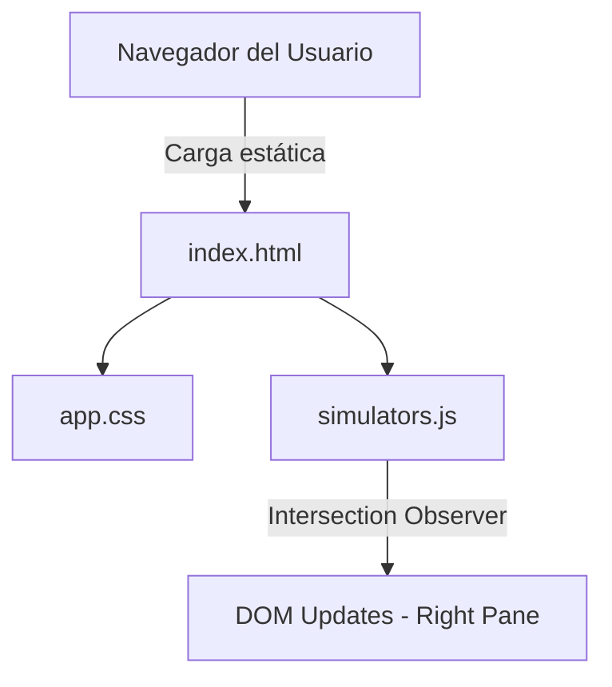

# Spec — Spec VJC Showcase

**Basada en:** PRD-lite v0.1 · `requirements.md` v0.1 (No existe, embebido) · **Etapa:** prototipo · **Exposición:** X1
**Fecha:** 2026-08-05 · **Versión:** 0.1

> Secciones 1-5, 11 y 12: núcleo, siempre. Secciones 6-10 y 13: se activan por exposición (`docs/modelo.md` §3.2). Las no activadas se omiten (marcadas con N/A).

## 1. Contexto y arquitectura
**Stack elegido:** HTML5, CSS3, Vanilla JS. (Ref: PRD AS-01)
**Componentes y flujo de datos:**

**Límites de confianza:** El sistema completo se ejecuta en el cliente (navegador). No hay backend ni procesamiento de datos de usuario, manteniendo un límite estricto de exposición nivel X1.

## 2. Trazabilidad
| Req ID | Requisito | Capacidad | Origen (E-n/RC-XX/C-n/AS-nn/ADR) | Criterio de verificación | Tipo |
|--------|-----------|:---:|----------------------------------|--------------------------|:---:|
| R-01 | UI Dividida (Split Screen) responsiva | C1 | C1 | Panel izquierdo narrativo y derecho visualizador | inspección |
| R-02 | Inyección de Simulador Evidencia | C2 | C2 | Al hacer scroll a la sección 1, aparece terminal | test-manual |
| R-03 | Inyección de Simulador Quality Gate | C3 | C3 | Al hacer scroll a la sección 3, aparece tabla | test-manual |
| R-04 | Inyección de Simulador Exposición | C4 | C4 | Al hacer scroll a la sección 4, aparece matriz | test-manual |
| R-05 | Comportamiento en móviles | C1 | AS-01 / A1 | El panel visualizador se fija ocupando la mitad inferior (`bottom: 0`, `height: 50vh`), mientras que la narrativa ocupa la mitad superior (`height: 50vh`). | test-manual |

## 3. Modelo de datos
(Como es estático, se refleja el estado efímero en memoria del cliente).

| Entidad | Campo | Tipo | Clasificación | Notas |
|---------|-------|------|:---:|-------|
| DOM_State | currentActiveStep | String | público | Rastreado por IntersectionObserver |

### 3b. Estados de las entidades
| Entidad | Estados | Cómo se persiste | Transiciones (req) |
|---------|---------|------------------|--------------------|
| DOM_State | hero, evidence, expand, quality, exposure | DOM / Memoria RAM | R-02, R-03, R-04 |

## 4. Contratos de API / interfaz
[N/A - Aplicación de frontend puramente estática sin endpoints de API].

## 5. Seguridad y privacidad
**Checklist de seguridad** aplicada ítem a ítem:
- Inyección dependencias seguras: Sí (Vanilla).
- Secretos expuestos: N/A (No hay variables de entorno ni API keys).

**STRIDE-lite** sobre el diagrama de la sección 1:
| Amenaza | Componente afectado | Mitigación | Req ID |
|---------|--------------------|-----------|--------|
| Tampering | Client DOM | Ejecución efímera, no persistida en servidor. | N/A |

### 5b. Datos personales [X2+]
[N/A - Omitida por exposición X1]

## 6. Accesibilidad [X1+]
Requisitos con ID:
- **A11Y-01:** Contraste texto/fondo WCAG 2.2 Nivel AA.
- **A11Y-02:** Todo el contenido de la columna izquierda debe ser navegable mediante `Tab`.
- **A11Y-03:** `[PENDIENTE: Definir si los simuladores de la derecha requieren etiquetas ARIA dinámicas al inyectar HTML]`.

## 7. Performance [X1+]
Presupuestos concretos:
- LCP (Largest Contentful Paint): < 1.5s
- CLS (Cumulative Layout Shift): 0.0 (El diseño en Split Screen fijo evita desplazamientos de layout).

## 8. Estrategia de test [X2+]
[N/A - Omitida por exposición X1]

## 9. Operación y observabilidad [X1+]
Entornos: Despliegue único en Netlify.
Despliegue automático conectado al branch `main` del repositorio `spec-vjc-framework`.
Observabilidad: `[PENDIENTE: Definir si se añade analítica básica (AS-02)]`.

## 10. Plan de medición
| Métrica del Go/No-Go | Evento o consulta que la instrumenta | Req ID | Herramienta |
|----------------------|--------------------------------------|--------|-------------|
| `[PENDIENTE]` | `[PENDIENTE]` | `[PENDIENTE]` | `[PENDIENTE]` |

## 11. Flujos de usuario
Camino principal:
- **Given** que el usuario carga la página principal,
- **When** hace scroll hacia abajo pasando el umbral del -40%,
- **Then** el `IntersectionObserver` detecta la nueva sección narrativa activa,
- **And** inyecta el HTML asociado (Simulador) en el panel derecho (`#visualizer-container`).
(Aplica a R-02, R-03, R-04).

## 12. Fuera de alcance
- Analítica web (Pendiente AS-02).

## 13. Módulo de cumplimiento [X3]
[N/A - Omitida por exposición X1]

## Quality Gate
<Anexado por /quality-gate.>

## Historial
| Versión | Fecha | Cambio | ADR |
|:---:|:---:|--------|-----|
| 0.1 | 2026-08-05 | Versión inicial estructurada bajo plantilla | — |
