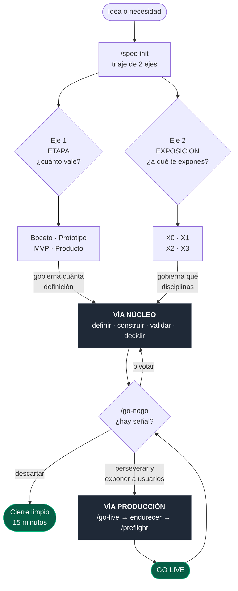
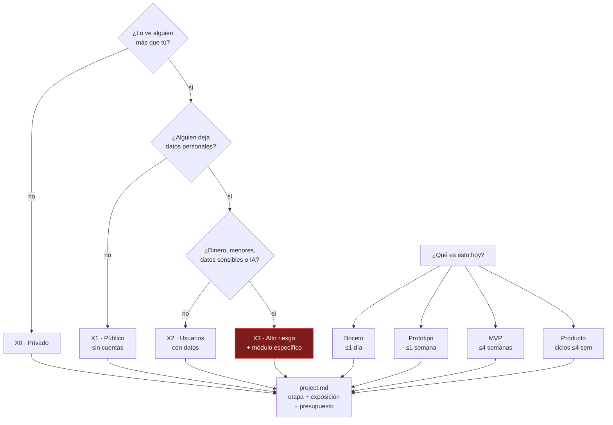
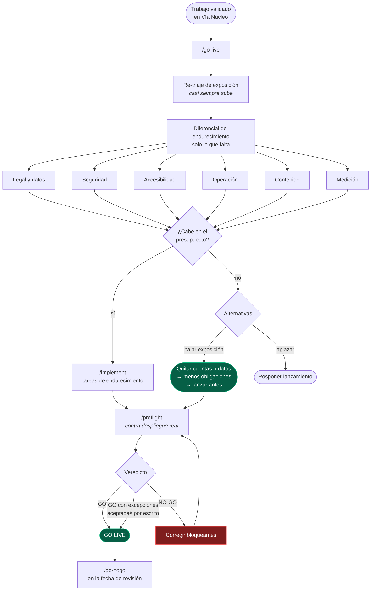
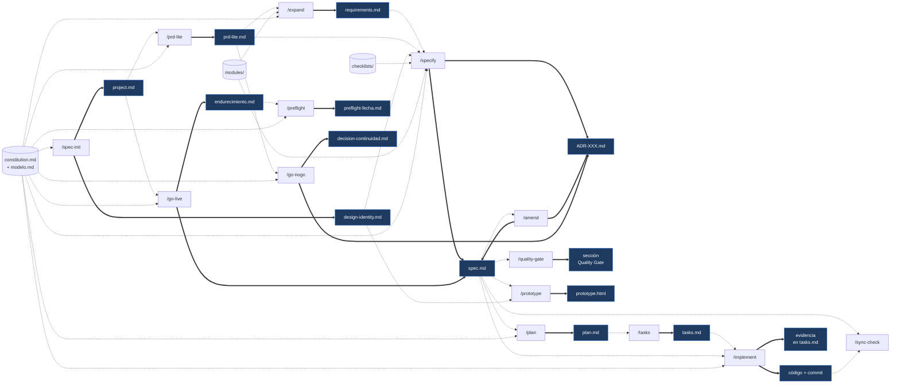
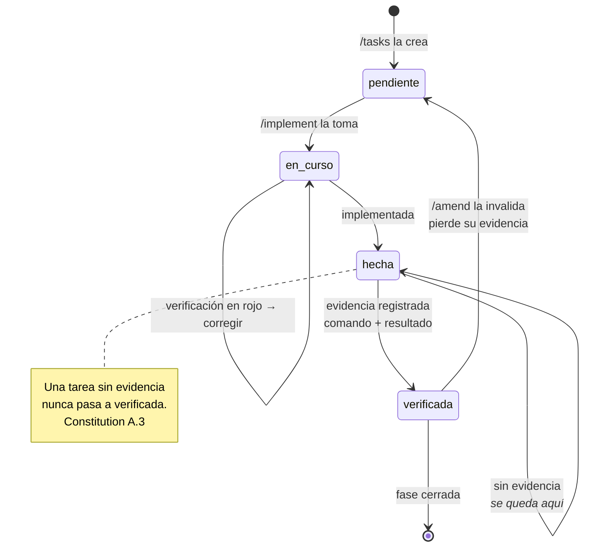
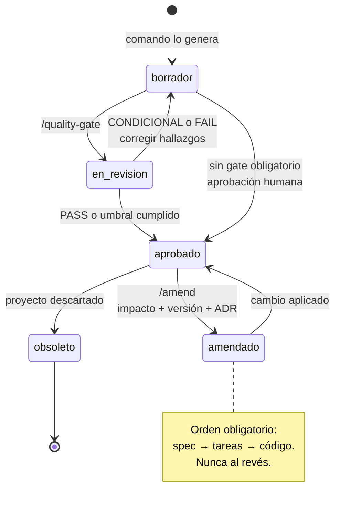
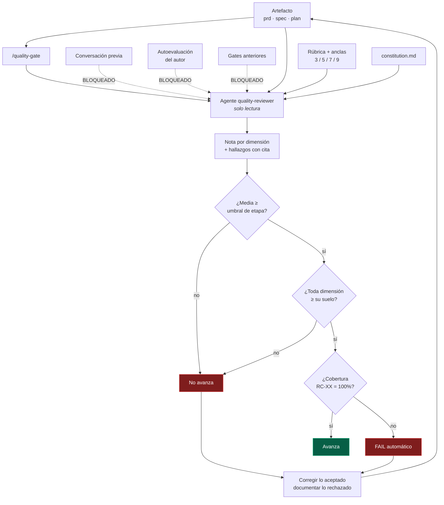
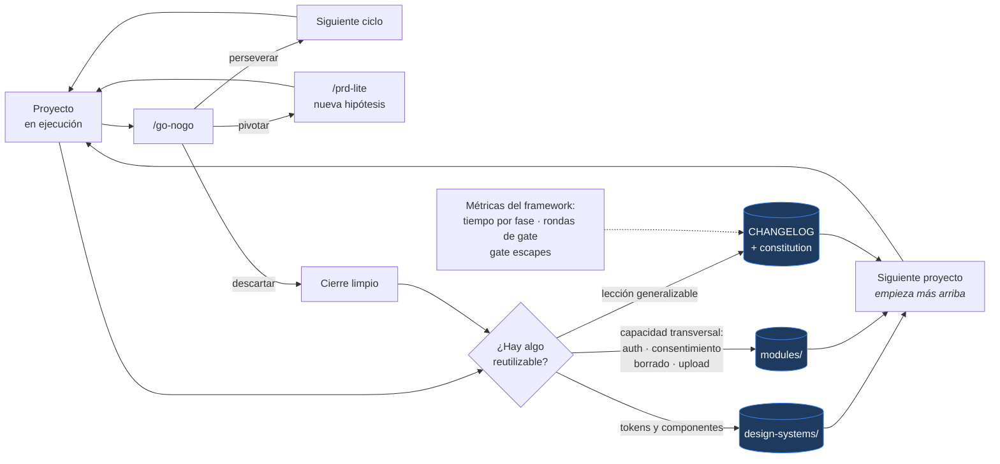
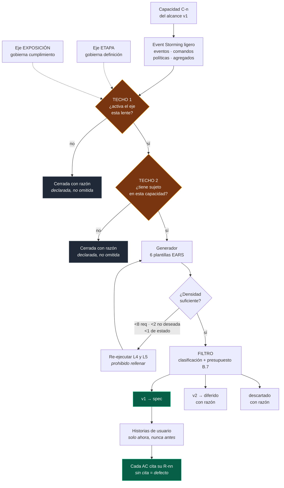

# Diagramas de flujo

Representación visual del framework: cómo se relacionan ejes, vías, comandos y artefactos. Los diagramas son Mermaid y renderizan en GitHub, en Obsidian y en la futura documentación pública.

**Índice**
1. [Mapa general](#1-mapa-general) · 2. [Triaje](#2-triaje-de-clasificación) · 3. [Vía Núcleo](#3-vía-núcleo-por-etapa) · 4. [Vía Producción](#4-vía-producción) · 5. [Comandos y artefactos](#5-comandos--artefactos-qué-lee-y-escribe-cada-uno) · 6. [Ciclo de una tarea](#6-ciclo-de-vida-de-una-tarea) · 7. [Ciclo de un artefacto](#7-ciclo-de-vida-de-un-artefacto) · 8. [Quality gate](#8-quality-gate) · 9. [Bucle de aprendizaje](#9-bucle-de-aprendizaje) · 10. [Expansión de requisitos](#10-expansión-de-requisitos-los-dos-techos)

---

## 1. Mapa general

Los dos ejes determinan qué se activa; las dos vías determinan cuándo.

---

## 2. Triaje de clasificación

Las preguntas de `/spec-init` y el nivel que activan. Ante la duda en exposición, **sube**.

---

## 3. Vía Núcleo por etapa

Lo que corre en cada etapa. Los comandos entre corchetes en el pipeline general son los que aparecen o desaparecen aquí.

```mermaid
flowchart LR
    subgraph BOC["BOCETO · X0 · ≤1 día"]
        direction LR
        B1["/spec-init"] --> B2["construir"] --> B3["usar"]
    end

    subgraph PRO["PROTOTIPO · ≤1 semana"]
        direction LR
        P1["/spec-init"] --> P2["/prd-lite<br/><i>modo corto</i>"] --> P3["/prototype"] --> P4["enseñarlo<br/>a 5 personas"] --> P5["/go-nogo"]
    end

    subgraph MVP["MVP · ≤4 semanas"]
        direction LR
        M1["/spec-init"] --> M2["/prd-lite"] --> M2E["/expand"] --> M3["/specify"] --> M3G{"gate"} --> M4["/prototype"] --> M5["/plan"] --> M6["/tasks"] --> M7["/implement<br/><i>× N tareas</i>"] --> M8["/go-nogo"]
    end

    BOC -.->|"sube de etapa"| PRO
    PRO -.->|"sube de etapa"| MVP

    classDef gate fill:#78350f,stroke:#f59e0b,color:#fff
    class M3G gate
```

**Producto** recorre lo mismo que MVP en ciclos de ≤4 semanas, añadiendo `/amend` para cada cambio de requisito y `/sync-check` al cerrar cada fase.

---

## 4. Vía Producción

Se activa al decidir llevar el trabajo a usuarios reales.

**Bloqueantes absolutos de `/preflight`** (no admiten excepción): secreto expuesto · dato personal accesible por quien no debe · incumplimiento de accesibilidad nivel A · falta de texto legal en X2+ · scripts sin consentimiento · copia de seguridad sin restaurar en X2+.

---

## 5. Comandos ↔ artefactos: qué lee y escribe cada uno

La relación real entre comandos. Una flecha continua es "escribe"; una discontinua, "lee".

`/amend` y `/sync-check` operan sobre los `R-nn`, que nacen en `requirements.md` y se proyectan a `spec.md` **sin renumerar**. Es la razón de que `/expand` asigne los IDs definitivos en lugar de una numeración propia: una tabla de mapeo entre dos numeraciones sería una cosa más que mantener sincronizada, y por tanto una cosa más que puede divergir.

---

## 6. Ciclo de vida de una tarea

El ciclo que impone `/implement`. La transición a `verificada` **solo existe con evidencia registrada**.

---

## 7. Ciclo de vida de un artefacto

Por qué existe `/amend`: un artefacto aprobado no se edita a mano.

---

## 8. Quality gate

Por qué la revisión es ciega y por qué hay suelo por dimensión.

**Umbrales (constitution C.14):** MVP media ≥6,5 y suelo 6,0 · Producto ≥7,0 y suelo 6,5 · cualquier etapa en X3 ≥7,5 y suelo 7,0.

---

## 9. Bucle de aprendizaje

Cómo cada proyecto deja al framework mejor que antes — incluidos los descartados.

> Un proyecto descartado que deja un activo reutilizable no fue tiempo perdido. Es el motivo por el que el cierre de `/go-nogo` incluye extraer lo reutilizable **antes** de archivar.

---

## 10. Expansión de requisitos: los dos techos

Cómo `/expand` convierte una capacidad de una línea en requisitos implementables sin sobredisparar. Lo que impide la sobreingeniería no es el filtro del final: son los **dos techos que van antes del generador**.

**Por qué dos techos y no un filtro.** Un generador sin límite con un filtro detrás produce masa que hay que descartar, y el descarte es trabajo. El techo 1 decide qué lentes tienen sentido en este proyecto; el techo 2, si esa lente tiene sujeto en esta capacidad concreta. Solo lo que pasa ambos llega al generador, y solo entonces el corte arbitra lo que cabe en el presupuesto.

**Por qué el cierre se declara por escrito.** Una lente cerrada en silencio y una lente olvidada son indistinguibles al leer el artefacto. Con la razón escrita, el gate puede juzgar si el techo se aplicó bien; sin ella, el mecanismo entero deja de ser auditable. Es el mismo motivo por el que un ítem de checklist se marca `N/A` con razón en lugar de borrarse.

**Reparto de las siete lentes entre los dos ejes** (`modelo.md` §3.4):

| Gobierna ETAPA · el dominio | Gobierna EXPOSICIÓN · la obligación |
|-----------------------------|-------------------------------------|
| L1 ciclo de vida de la entidad | L2 permisos rol × estado |
| L3 validaciones y límites | L6 concurrencia |
| L4 modos de fallo | L7 auditoría y su mitad negativa |
| L5 fronteras y vacío | |

No es una convención del comando: es la aplicación directa de `modelo.md` §6 — *exposición gana a etapa en cumplimiento, etapa gana a exposición en definición*.
