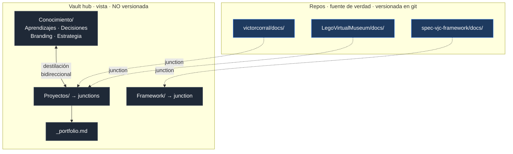

# Integración con Obsidian

Cómo el vault documental de cada proyecto se convierte en el respaldo funcional de todo el portfolio, sin duplicar información ni acoplar la documentación al ritmo del código.

---

## 1. Diagnóstico del estado actual

Verificado sobre el entorno real (`C:\Users\victo\OneDrive\Documentos\GitHub`, julio 2026):

| Hallazgo | Implicación |
|----------|-------------|
| Existe un vault en `victorcorral/vault/`, organizado **por tipo** (Aprendizajes, Decisiones, Branding, Estrategia) | Es un vault de conocimiento transversal, no de proyecto. Convive con el modelo del framework, no compite |
| **Solo plugins core**, sin plugins de comunidad | La integración **no puede depender de Dataview**. Debe funcionar con Propiedades, búsqueda, grafo, canvas y plantillas |
| `properties`, `canvas`, `templates` y `sync` activos | Hay base suficiente para consultas por propiedades y vistas visuales sin instalar nada |
| `LegoVirtualMuseum/.gitignore` ya excluye `.obsidian/` | Decisión correcta y ya tomada: la configuración de interfaz es personal, no del proyecto |
| `LegoVirtualMuseum/docs/` ya sigue la estructura del framework | El nivel de proyecto ya funciona |

**Conclusión:** el nivel de proyecto está resuelto. Lo que falta es el **nivel de portfolio**: poder ver los cuatro proyectos a la vez sin cambiar de vault, y que el conocimiento transversal se alimente de los proyectos.

---

## 2. Las tres arquitecturas posibles

### Opción A — Un vault por proyecto (`docs/` de cada repo)

**A favor:** cero configuración, funciona hoy, versionado con el código, portable — quien clone el repo tiene el vault.
**En contra:** cambiar de proyecto = cambiar de vault. Sin vista de portfolio. El conocimiento transversal queda aislado del proyecto que lo generó. Los enlaces entre proyectos no resuelven.

### Opción B — Un vault único en la raíz de `GitHub/`

**A favor:** todo visible a la vez, enlaces entre proyectos funcionan, una sola configuración.
**En contra:** Obsidian indexa **todo** el árbol, incluidos `node_modules`, README de dependencias y ficheros de build. El ajuste "Archivos excluidos" los quita de búsqueda y grafo, pero **no evita el indexado**: en repos con dependencias instaladas, degrada el rendimiento y ensucia el buscador rápido.

### Opción C — Vault hub con junctions ✅ recomendada

Un vault dedicado fuera de los repos que contiene **enlaces de directorio** a los `docs/` de cada proyecto y a las carpetas de conocimiento existentes.

**A favor:** todo lo bueno de B sin el ruido de B. Cada `docs/` sigue viviendo en su repo y versionándose con su código; el hub es solo una **vista**. Se añade y se quita un proyecto en un comando.
**En contra:** requiere un paso de configuración por proyecto, y el hub no se versiona (es una vista, no una fuente).

**Verificado en este entorno:** las junctions de Windows se crean **sin permisos de administrador** (a diferencia de los enlaces simbólicos) y el contenido se lee correctamente a través del enlace.
**`[PENDIENTE: smoke test en Obsidian]`** — queda por confirmar que el detector de cambios de Obsidian refresca correctamente a través de junctions cuando un fichero se modifica desde fuera (por ejemplo, al hacer `git pull`). Si no lo hiciera, basta con recargar el vault. Constitution D.20: no se da por bueno hasta probarlo en destino.

---

## 3. Arquitectura recomendada: dos niveles



**Nivel proyecto** — `docs/` del repo. Fuente de verdad. Lo generan los comandos, viaja con el código, se versiona en git. **No cambia nada de lo que ya hay.**

**Nivel portfolio** — el vault hub. Una vista de solo lectura conceptual sobre los proyectos, más el conocimiento transversal que ya tienes. Es donde ves los cuatro proyectos a la vez, dónde vives el día a día y desde donde se destila el aprendizaje.

**Regla de no duplicación:** un contenido vive en un solo sitio. El hub **no copia** nada de los proyectos: los enlaza. Si algo del proyecto merece ser conocimiento transversal, se **destila** (una nota nueva en `Conocimiento/` que enlaza al original), nunca se copia.

---

## 4. Propiedades: la pieza que hace funcionar el portfolio

Sin plugins de comunidad, lo que permite consultar varios proyectos a la vez son las **propiedades YAML** (plugin core Properties). Todas las plantillas del framework las incluyen desde la v1.1.

```yaml
---
proyecto: lego-virtual-museum
tipo: prd | spec | plan | tasks | adr | preflight | decision | comunicacion | proyecto
etapa: boceto | prototipo | mvp | producto
exposicion: X0 | X1 | X2 | X3
estado: borrador | en-revision | aprobado | obsoleto
version: 0.1
fecha: 2026-07-27
tags: [spec-vjc]
---
```

**Por qué estos campos y no más:** cada uno responde a una pregunta que te harás de verdad sobre el portfolio. `proyecto` agrupa; `tipo` filtra por artefacto; `etapa` y `exposicion` dicen en qué punto está cada cosa; `estado` distingue lo aprobado de lo que aún se mueve; `fecha` ordena. Añadir más campos es metadatos que nadie consulta.

### Consultas útiles con la búsqueda nativa

| Qué quieres saber | Búsqueda |
|-------------------|----------|
| Todo lo del framework | `tag:#spec-vjc` |
| Specs aprobadas de todos los proyectos | `["tipo":"spec"] ["estado":"aprobado"]` |
| Todo lo de un proyecto | `["proyecto":"lego-virtual-museum"]` |
| Proyectos con datos personales | `["exposicion":"X2"] OR ["exposicion":"X3"]` |
| Definición aún sin cerrar | `["estado":"borrador"] ["tipo":"spec"]` |
| Huecos declarados en cualquier proyecto | `"[PENDIENTE"` |

Esa última es la más valiosa: **una sola búsqueda te da todos los `[PENDIENTE]` de todo el portfolio**, que es exactamente lo que el principio A.1 genera y lo que suele perderse de vista.

---

## 5. Montaje del hub

Ejecutar una vez. Crea el hub y engancha los proyectos existentes.

```powershell
$hub = "$env:USERPROFILE\Obsidian\VJC-Hub"
$gh  = "$env:USERPROFILE\OneDrive\Documentos\GitHub"

New-Item -ItemType Directory -Force -Path "$hub\Proyectos", "$hub\Framework" | Out-Null

foreach ($p in @("LegoVirtualMuseum","victorcorral")) {
  $link = "$hub\Proyectos\$p"
  if (-not (Test-Path $link)) { New-Item -ItemType Junction -Path $link -Target "$gh\$p\docs" | Out-Null }
}

$fw = "$hub\Framework\spec-vjc-framework"
if (-not (Test-Path $fw)) { New-Item -ItemType Junction -Path $fw -Target "$gh\spec-vjc-framework" | Out-Null }

Write-Output "Hub listo en $hub. Abrelo en Obsidian con 'Abrir carpeta como vault'."
```

Añadir un proyecto nuevo más adelante:

```powershell
New-Item -ItemType Junction -Path "$env:USERPROFILE\Obsidian\VJC-Hub\Proyectos\<NOMBRE>" -Target "$env:USERPROFILE\OneDrive\Documentos\GitHub\<NOMBRE>\docs"
```

Quitar un proyecto del hub (sin tocar el repo): borrar la junction con `cmd /c rmdir <ruta-del-enlace>`. **Importante:** usa `rmdir` sobre el enlace, nunca `Remove-Item -Recurse`, que podría recorrerlo y borrar el contenido real.

Enganchar el vault de conocimiento existente: junction de `$hub\Conocimiento` a `$gh\victorcorral\vault`.

---

## 6. Convenciones

**Enlaces en formato Markdown, no wiki-links.** Ajustes → Archivos y enlaces → *"Usar [[Wikilinks]]"* **desactivado**. Razón: los repos se publican en GitHub, que renderiza `[texto](ruta.md)` pero no `[[nota]]`. Los enlaces Markdown funcionan en ambos; los wiki-links solo en Obsidian. Con enlaces relativos, la documentación es navegable desde GitHub, desde Obsidian y desde la futura web pública sin transformarla.

**`.obsidian/` siempre en `.gitignore` de cada proyecto.** Es estado de interfaz personal. Ya está hecho en LegoVirtualMuseum; replicarlo en cada repo nuevo.

**La configuración vive en el hub**, no en los proyectos. Un solo `.obsidian/` que gobierna la vista de todo.

**Nombres de fichero estables.** Renombrar un artefacto rompe enlaces y trazabilidad. Las versiones van en la propiedad `version` y en la tabla de historial del artefacto, nunca en el nombre (`spec-v2-final.md` es exactamente lo que el framework prohíbe).

**Obsidian Sync y git no se pisan** porque operan sobre árboles distintos: git versiona los `docs/` dentro de cada repo; Sync replica el hub, cuyo contenido real son esos mismos ficheros a través de junctions. Si activas Sync sobre el hub, **excluye las carpetas enlazadas** para evitar que Sync y git compitan por los mismos ficheros: deja que git sea la única autoridad sobre lo que está dentro de un repo.

---

## 7. Vistas sin instalar nada

**`_portfolio.md`** en la raíz del hub: portada con enlaces a cada proyecto, su etapa, exposición y estado. Se actualiza a mano al cambiar de fase — son cuatro líneas, no merece automatización.

**Grafo local** sobre un `spec.md`: muestra de un vistazo qué ADRs, tareas y decisiones cuelgan de esa spec. Es la mejor herramienta para detectar un requisito huérfano.

**Canvas** para los diagramas de fase: `docs/diagramas.md` cubre el flujo del framework; un canvas por proyecto sirve para su arquitectura concreta.

**Marcadores** a los cuatro ficheros que abres a diario: `_portfolio.md`, el `project.md` y el `tasks.md` del proyecto activo, y `constitution.md`.

**Búsqueda guardada** de `"[PENDIENTE"` como marcador. Es tu lista de deuda de definición de todo el portfolio.

---

## 8. Mejoras opcionales

Solo si en algún momento aceptas plugins de comunidad, y con el vetting de `checklists/seguridad-agentica.md` (ítems 1-3) antes de instalar:

- **Dataview** — tablas automáticas del portfolio: todos los proyectos con su etapa, exposición y estado en una tabla que se actualiza sola. Es la mejora de mayor impacto sobre lo que hay.
- **Bases** (núcleo, en versiones recientes de Obsidian) — vistas de tabla sobre propiedades sin plugin externo. Si tu versión lo incluye, cubre buena parte de Dataview sin dependencia de comunidad.

Ninguna es necesaria. Todo lo descrito arriba funciona con lo que ya tienes instalado.

---

## 9. Qué queda por verificar

| Punto | Estado |
|-------|--------|
| Junctions sin admin | ✅ verificado en este entorno |
| Lectura de ficheros a través de junction | ✅ verificado |
| Refresco de Obsidian ante cambios externos vía junction | `[PENDIENTE: abrir el hub y hacer un git pull para comprobarlo]` |
| Búsqueda por propiedades `["clave":"valor"]` | `[PENDIENTE: confirmar en tu versión de Obsidian; alternativa segura: tags]` |
| Obsidian Sync sobre carpetas enlazadas | `[PENDIENTE: si activas Sync, excluir las junctions primero]` |
